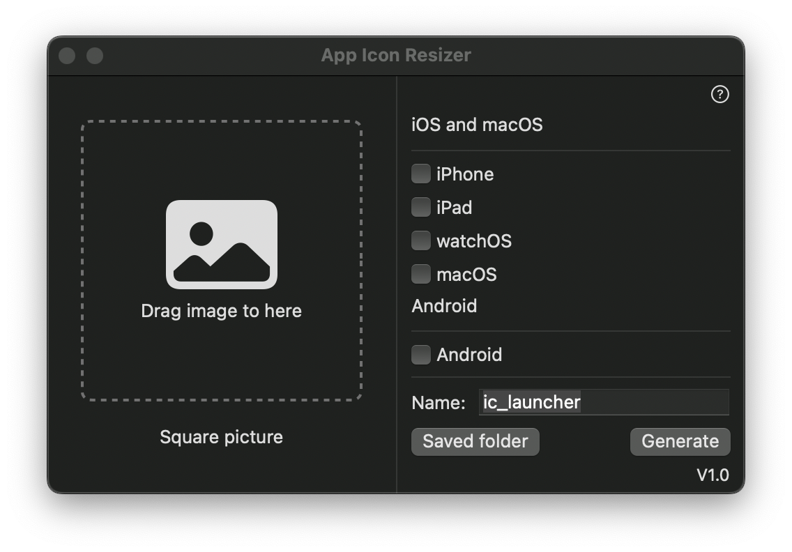
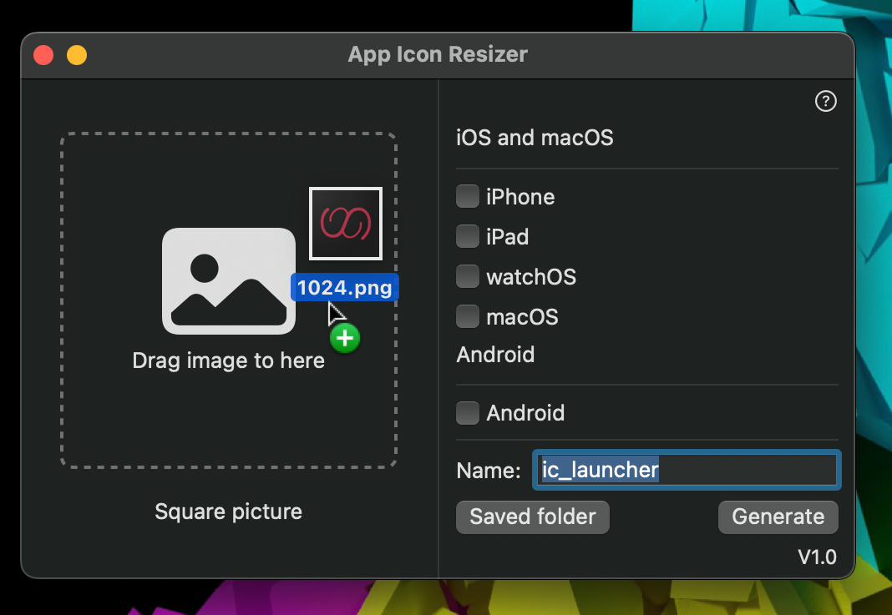
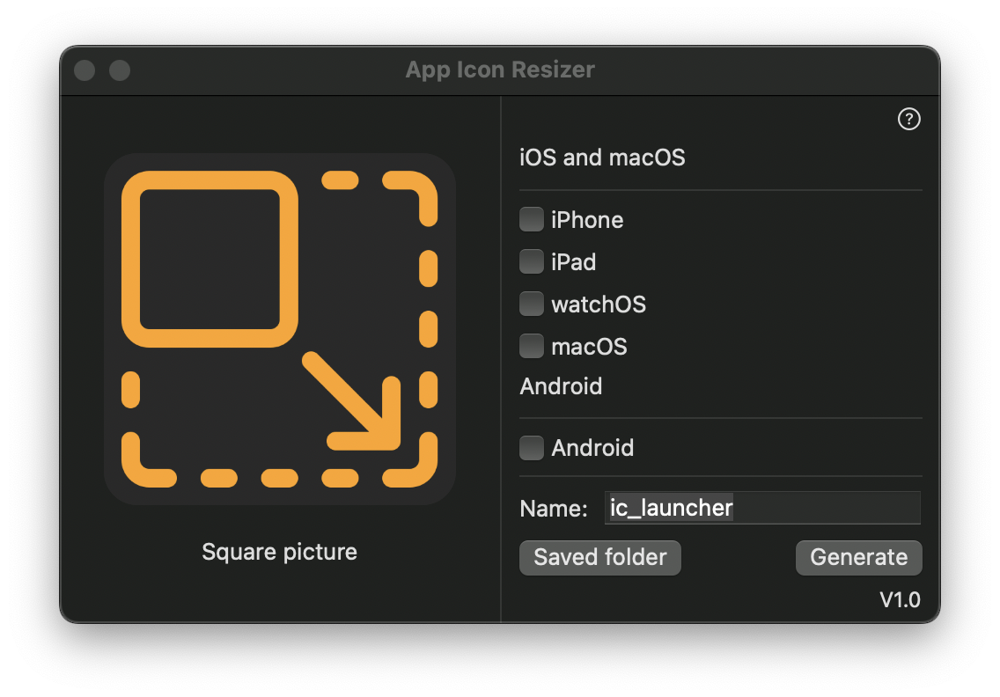
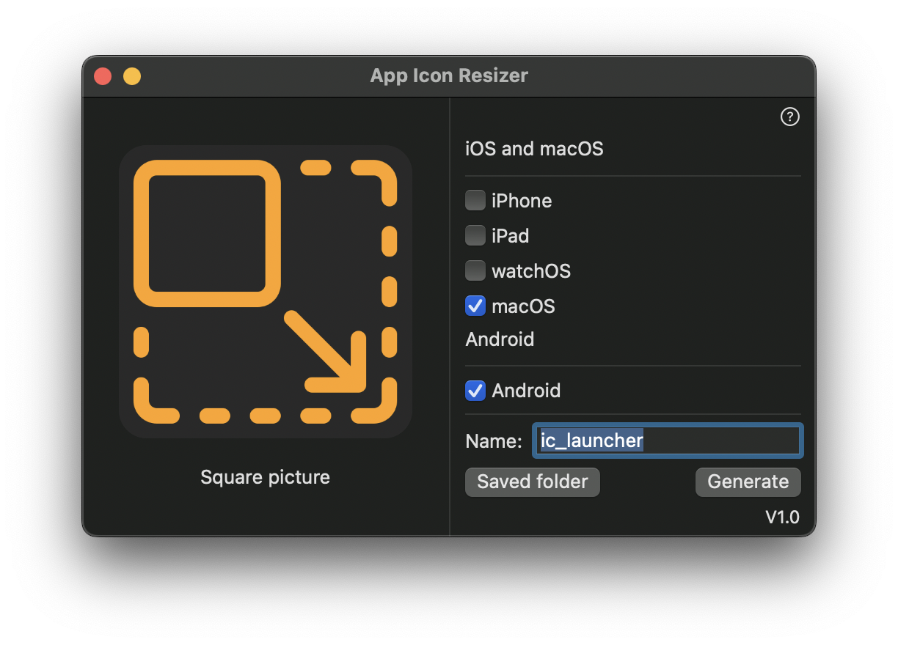
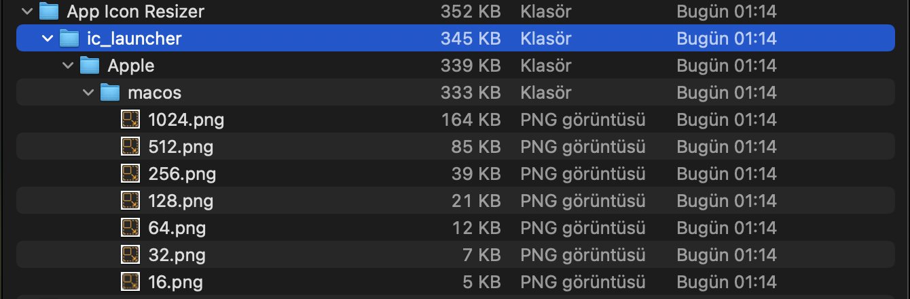
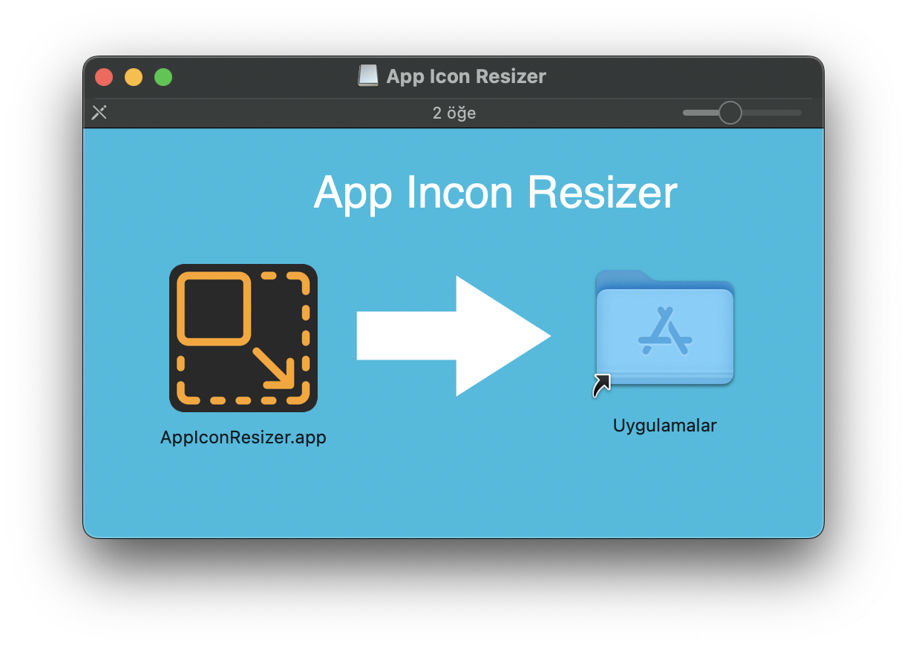
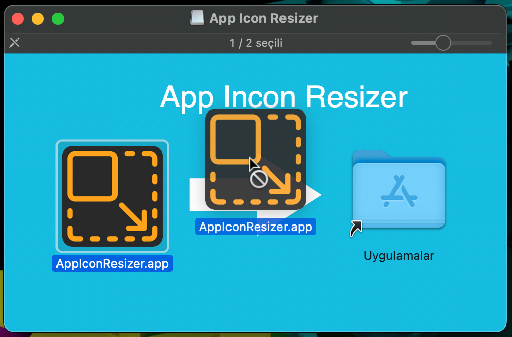
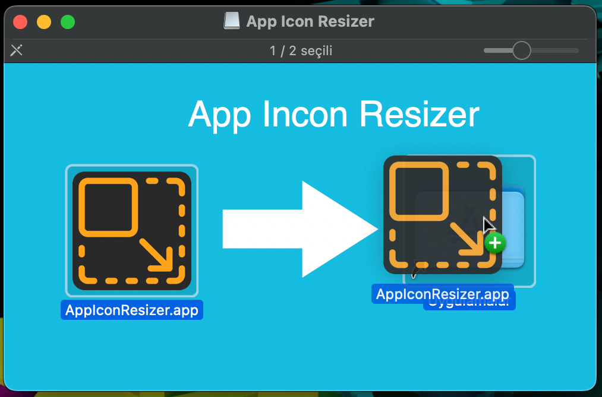

# App Icon Resizer


App Icon Resizer is a desktop application developed with Swiftui that helps developers in the task of automating the generation of graphic assets in several sizes.

## Usage
It offers a simple use that works with drag and drop and select action logic.
### Step 1 Open App


### Step 2 Drag an Drop Logo 


### Step 3 


### Step 3 Select platform and name 


### Step 4 Ready to use 


## Download App
- [Download dmg](https://github.com/uguraltinsoy/AppIconResizer/raw/main/AppIconResizer%20V1.0.dmg)

## Setup
If you get the error, Control + right click and open
```
"App Icon Resizer" cannot be opened because the developer cannot be verified
```

### Open dmg


### Swipe app icon to applications



## Dimensions by platform
### Android
- mipmap-mdpi : 48x48
- mipmap-hdpi : 72x72
- mipmap-xhdpi : 96x96
- mipmap-xxhdpi : 144x144
- mipmap-xxxhdpi : 192x192

### Iphone Size
- 29x29
- 40x40
- 57x57
- 58x58
- 60x60
- 80x80
- 87x87
- 114x114
- 120x120
- 180x180
- 1024x1024

### Ipad Size
- 20x20
- 29x29
- 40x40
- 50x50
- 58x58
- 72x72
- 76x76
- 80x80
- 100x100
- 144x144
- 152x152
- 167x167

### WacthOS Size
- 48x48
- 55x55
- 58x58
- 80x80
- 87x87
- 88x88
- 100x100
- 172x172
- 196x196
- 216x216
- 1024x1024

### MacOS Size
- 16x16
- 32x32
- 64x64
- 128x128
- 256x256
- 512x512
- 1024x1024


### Developer By
```
Uğur Altınsoy
```

## ☕️ Do you like the project?

<a href="https://www.buymeacoffee.com/uguraltnsy" target="_blank"></a>

### Donate
```
BTC  : 1N7V3wX4xvGfwgBP1zQrcMSxohKKfiDxyH
ETH  : 0x0df6da87e219fb4854e933f1071ad91d17afa517
XRP  : rEb8TK3gBgk5auZkwc6sHnwrGVJH8DuaLh
DOGE : DKKmSHAa8GhAE5HNjmCXzkXPKTjpybY3mq
DENT : 0x0df6da87e219fb4854e933f1071ad91d17afa517
```

### Social
[](https://twitter.com/uguraltnsy)
[](https://www.instagram.com/ugur.altnsy)
[](https://www.linkedin.com/in/uğur-altınsoy/)
[](https://play.google.com/store/apps/developer?id=DeepLab&hl=tr)
